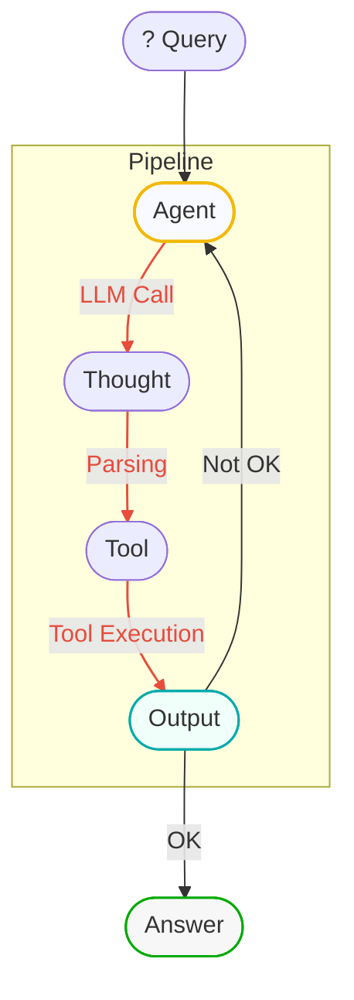
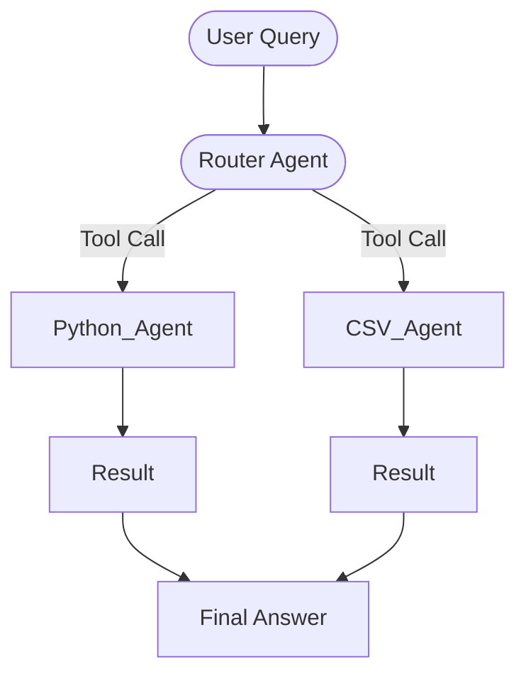
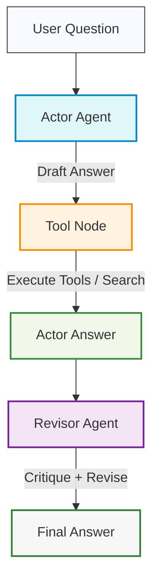

# agentic-rag-langgraph
This branch is a hands-on learning project to deepen my expertise in building an agentic RAG system with LangGraph—covering ingestion, retrieval, filtering, generation, web-search integration, self-refinement, and adaptive behavior.

## Ice Breaker
This application uses agents and a scraper—"Scrape Any Data"—to extract data from websites. Specifically, it is designed to find information about a person on LinkedIn and generate structured information about them.


## ReAct AgentExecutor – From Scratch

This branch implements a **ReAct AgentExecutor** step by step with LangChain, including a complete understanding of the ReAct algorithm and modern best practices.

### 📌 Goals
- Build a ReAct agent from scratch
- Understand the ReAct algorithm and its components
- Implement and integrate custom tools
- Use CallbackHandlers to control agent flow
- Prepare for transition to modern tool calling

### 📂 Contents

#### 1. Environment Setup & Algorithm Overview
- Setting up the development environment
- Overview of the ReAct algorithm and its core principles

#### 2. Defining Tools
- Creating custom tools for the agent
- Interfaces for tool integration

#### 3. Debugging
- Solving common errors:
    - Stop token issues
    - Template indentation issues

#### 4. ReAct Prompt & Reasoning Engine
- Creating the ReAct prompt
- Implementing the LLM reasoning engine
- Output parsing & tool execution

#### 5. Agent Core Components
- `AgentAction`
- `AgentFinish`
- Agent loop

#### 6. CallbackHandlers
- Using them to control and finalize the agent loop

#### 7. Recap & LangSmith
- Brief recap of the implementation
- Monitoring and debugging with LangSmith

### 🛠 Technologies
- Python 3.x
- [LangChain](https://python.langchain.com/)
- OpenAI / Azure OpenAI API
- LangSmith
### Flow (Mermaid)



# Agentic Tool-Routing Mini Project (LangChain + Azure OpenAI)

This small project demonstrates how to build a **tool-calling agent** that routes user requests to the right specialist:
1) a **Python Agent** that **writes & executes Python code** via a REPL, and  
2) a **CSV Agent** that answers questions about a local CSV file (`episode_info.csv`) using pandas.

It uses **LangChain’s tool calling**, a prompt from the **LangChain Hub**, and **Azure OpenAI** as the LLM backend.

---

## How it works

- We pull the `react-agent-template` from the LangChain Hub and partially fill it with tool names and instructions.
- Two tools are exposed to the LLM:
  - **Python_Agent** → turns natural-language tasks into Python code and runs it in a REPL.  
    > Example task: generate 15 QR codes into a `qrcodes/` folder.
  - **CSV_Agent** → answers questions about `episode_info.csv` (e.g., counts, filtering) by running pandas ops.
- A **router agent** (LLM) decides which tool to call for a given input and returns the final result.

### Flow (Mermaid)



# Reflexion Agent

This repository demonstrates the step-by-step development of a **Reflexion Agent** using LangChain and LangGraph.  
It follows the progression of the lecture series, with each stage introducing new components and concepts in agent design.

---

## 📌 Development Timeline

### 🏗️ Project Setup
- Added initial project structure  
- Configured foundation files:  
  - `.gitignore`  
  - `main.py`  
  - `pyproject.toml`  
  - `poetry.lock`  

### 🎭 Actor Agent
- Implemented the first component of the architecture: the **Actor**  
- Created `chains.py` with prompt templates for generating detailed answers  
- Added `schemas.py` with **Pydantic models** for structured data handling  

### 🪞 Revisor Agent (Self-Reflection)
- Implemented the **Revisor** component for answer revision and critique  
- Added `ReviseAnswer` model to `schemas.py` for improved response structure  
- Updated chain prompts to incorporate critique and citation requirements  

### 🛠️ ToolNode & Tool Execution
- Integrated **search functionality** for more accurate responses  
- Added required dependencies for tool execution within the graph  

### 🔗 LangGraph Workflow
- Built the complete **message graph** connecting **Actor** and **Revisor**  
- Defined graph nodes for drafting, tool execution, and revision  
- Established **state management** and conditional edge routing to enable reflection  

---
## 📊 Architecture Overview



## 📖 Agentic RAG

This module implements an **Agentic RAG pipeline** using LangGraph.  
The section demonstrates the progressive construction of an agent that retrieves, filters, and augments context before generating final answers.

### Architecture Overview
```mermaid
flowchart TD
    A[User Query] --> B[GraphState]
    B --> C[Retrieve Node]
    C --> D[Relevance Filter\n(Structured Output)]
    D --> E[External Tools\n(Web Search, APIs)]
    E --> F[LLM Generation Node]
    F --> G[Final Answer]

    style A fill:#F9FAFF,stroke:#333,stroke-width:1px
    style B fill:#E0F7FA,stroke:#0288D1,stroke-width:2px
    style C fill:#FFF3E0,stroke:#FB8C00,stroke-width:2px
    style D fill:#F3E5F5,stroke:#7B1FA2,stroke-width:2px
    style E fill:#F1F8E9,stroke:#388E3C,stroke-width:2px
    style F fill:#FFEBEE,stroke:#C62828,stroke-width:2px
    style G fill:#F7F7F7,stroke:#2E7D32,stroke-width:2px

```